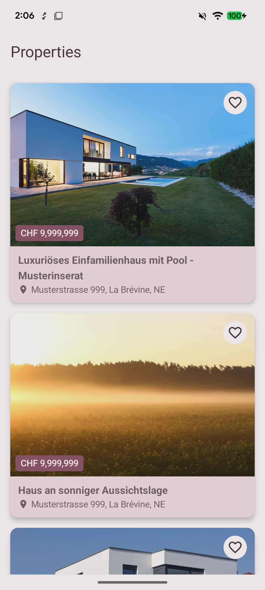
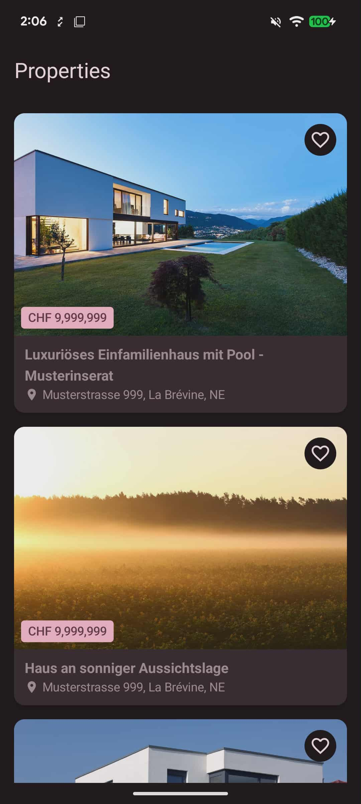

# SimpleRealEstate

Simple Android App that displays real estate listings.

## Screenshots

| Light Mode | Dark Mode |
|:----------:|:---------:|
|  |  |

## Features

- Browse real estate property listings
- Bookmark properties
- Support for Light and Dark themes

## Requirements

- Android 10 (API 29) or higher
- JDK 17

## Getting Started

1. Clone the repository
   ```bash
   git clone https://github.com/yourusername/SimpleRealEstate.git
   ```

2. Open the project in Android Studio

3. Build and run the app
   ```bash
   ./gradlew assembleDebug
   ```

## Architecture

This project follows **Clean Architecture** with **MVVM** pattern:

```
app/
├── data/           # Data layer (API, repositories implementation, mappers)
├── domain/         # Domain layer (use cases, repository interfaces, models)
├── di/             # Dependency injection modules
├── ui/             # Presentation layer (screens, viewmodels, components)
└── core/           # Core utilities and constants
```

## Main Libraries

| Library | Purpose |
|---------|---------|
| **Jetpack Compose** | Modern declarative UI toolkit |
| **Hilt** | Dependency injection |
| **Retrofit** | HTTP client for API calls |
| **Kotlin Serialization** | JSON parsing |
| **Coil** | Image loading |
| **Navigation Compose** | In-app navigation |
| **Coroutines & Flow** | Asynchronous programming |

## Testing

- **Unit Tests**: JUnit, Mockito, Turbine (for Flow testing)
- **UI Tests**: Compose UI Testing
